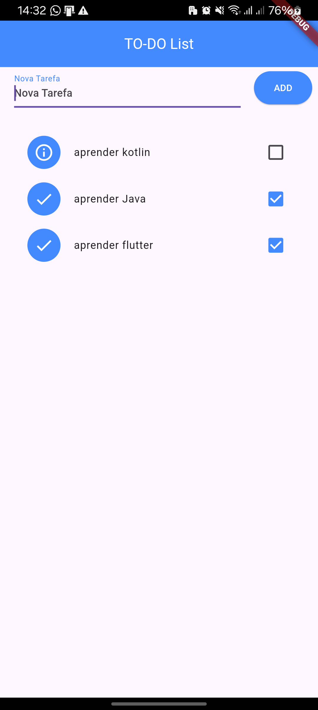
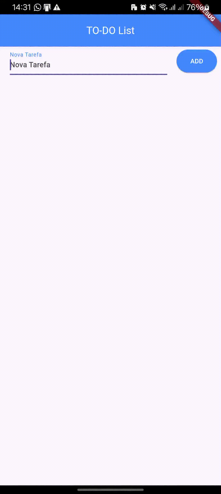

# TO-DO List App

## Descrição

Este é um aplicativo simples de lista de tarefas desenvolvido em Flutter. Ele permite aos usuários gerenciar suas tarefas diárias de forma eficiente e intuitiva.

## Funcionalidades

- Adicionar novas tarefas
- Marcar tarefas como concluídas
- Remover tarefas deslizando para o lado
- Desfazer a remoção de tarefas
- Ordenar tarefas automaticamente (concluídas e não concluídas)
- Persistência de dados (as tarefas são salvas localmente)

## Capturas de Tela




## Instalação

1. Certifique-se de ter o Flutter instalado em seu sistema. Para instruções de instalação, visite [flutter.dev](https://flutter.dev/docs/get-started/install).

2. Clone este repositório:
   ```
   git clone https://github.com/seu-usuario/to-do-list-app.git
   ```

3. Navegue até o diretório do projeto e instale as dependências:
   ```
   cd to-do-list-app
   flutter pub get
   ```

4. Execute o aplicativo:
   ```
   flutter run
   ```

## Uso



1. Para adicionar uma nova tarefa, digite o texto no campo de entrada na parte superior da tela e pressione o botão "ADD".
2. Para marcar uma tarefa como concluída, toque no checkbox ao lado da tarefa.
3. Para remover uma tarefa, deslize-a para a direita.
4. Se remover uma tarefa por engano, use a opção "Desfazer" que aparece na parte inferior da tela.

## Tecnologias Utilizadas

- Flutter
- Dart
- path_provider (para persistência de dados local)


